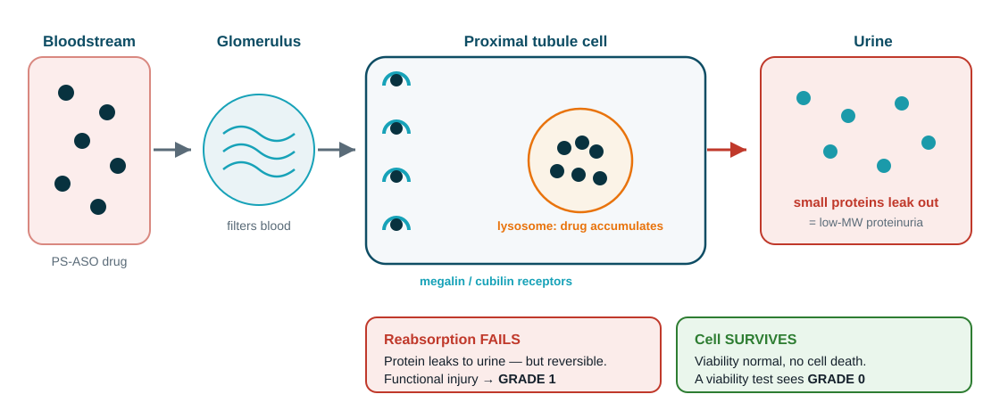
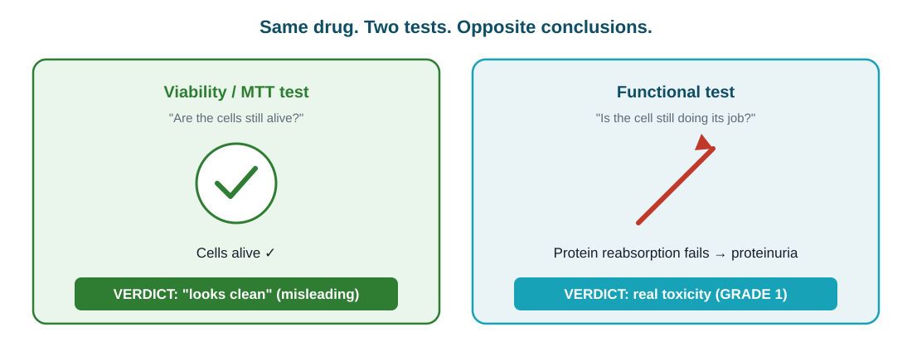
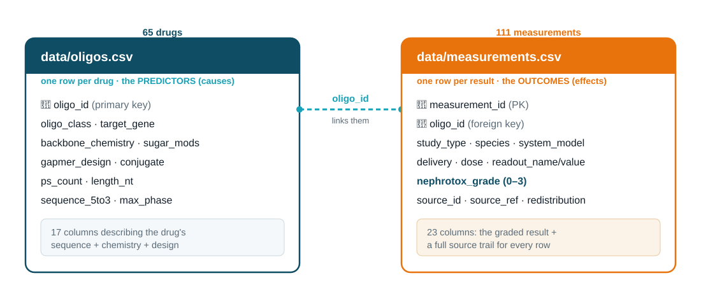
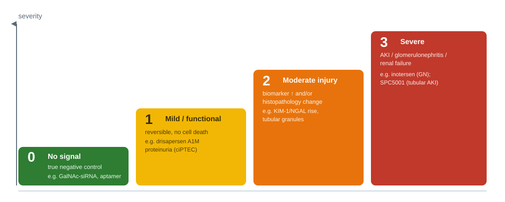
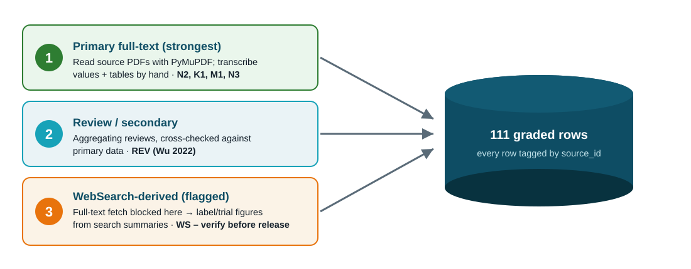
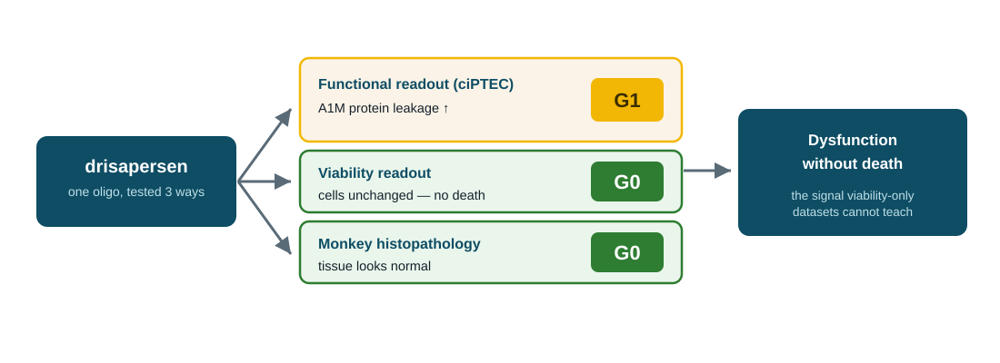
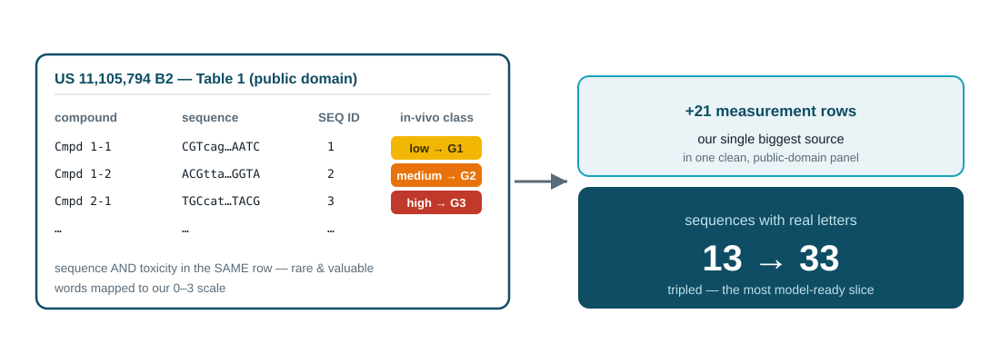
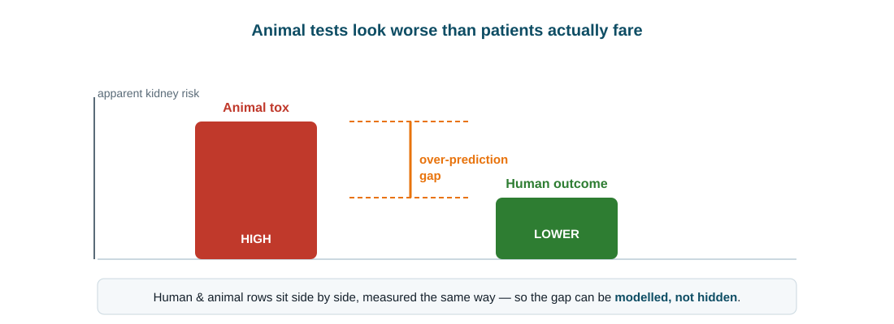

<!-- _class: title -->
<!-- _paginate: false -->
<!-- _footer: '' -->

NCATS OligoTox Open Data Challenge · Phase 2

# OligoTox-Kidney

A curated, per-measurement <b style="color:#fff">kidney-toxicity</b> dataset for oligonucleotide therapeutics

65 oligos · 111 measurements · 35 target genes · 100% kidney-specific 
Phase 2 · Data Generation · prepared for biochemistry-expert review · June 2026

<!--
SPEAKER NOTES — plain English

One-line pitch: we built a clean, well-documented SPREADSHEET of evidence on how
oligonucleotide drugs can harm the kidney — for a public NIH/NCATS data challenge.

Terms:
• "Oligonucleotide" (oligo) = a drug made of a short string of genetic letters
  (DNA/RNA), ~12–25 long, designed to switch a specific gene on/off. ~19 approved.
• "Nephrotoxicity" = kidney toxicity (nephro = kidney).
• "Per-measurement" = each row is one experimental result, the finest detail.
• "NCATS Phase 2" = the data-generation phase of the challenge; it scores DATASETS.
This deck is for a biochemistry expert to review the science and sign off the grades.
-->

---

<!-- _class: lead -->
<!-- _footer: '' -->

The idea in one sentence

Oligonucleotide drugs can injure the kidney in a way the <b>standard safety test misses</b> — so we built a dataset that captures the <b>right</b> signal, one experiment per row, every value traceable to its source.

<!--
SPEAKER NOTES — plain English

This frames the whole project. The "standard safety test" is the cheap
"are the cells alive?" test. These drugs often DON'T kill cells, so that test
gives a false all-clear. Our dataset is designed to record the subtler "the cell
is alive but not working" damage instead. "Traceable to source" = every number
points back to the exact paper/patent table it came from.
-->

---

## Why this matters

**Oligonucleotides are a booming drug class** — ~19 already approved, dozens in trials, treating diseases nothing else could.

**But the kidney is a common casualty.** The kidney filters and concentrates these drugs, so it is exposed to high levels — and several oligos have caused proteinuria, kidney injury, even kidney failure.

**The catch:** the damage is often *invisible* to routine cell-survival screening (next slides).

<b>The gap Phase 2 targets</b> 
Most public oligo-tox data is <b>hepatic</b>; kidney-specific data is thin. No open dataset pairs each oligo's <b>design</b> (sequence + chemistry) with a <b>graded kidney outcome</b> — exactly what an <b>in-silico model</b> needs to predict risk early. That is what we assembled.

<!--
SPEAKER NOTES — plain English

Why kidney, why now. Oligo drugs are a fast-growing, important class. The kidney
is especially exposed because it filters the blood and concentrates whatever
passes through, so these drugs pile up there. Several have caused real kidney
problems. "Proteinuria" = protein leaking into urine, a classic kidney-trouble
sign. Most existing open oligo-tox data is about the LIVER; kidney is under-served
— so an open kidney set fills a real public gap (Phase 2's "potential impact").
The missing piece is a tidy table linking each drug's design to a kidney-toxicity
score, ready for an in-silico model — that is our contribution.
-->

---

<!-- _class: section -->
<!-- _footer: '' -->
<!-- _paginate: false -->

Part 1

## The science: a quiet kind of kidney injury

Why a cell-survival test gives these drugs a false "all-clear"

---

## How these drugs injure the kidney

Phosphorothioate ASOs are filtered, then vacuumed into proximal-tubule cells by the megalin/cubilin receptors and stored in lysosomes. Reabsorption of small proteins fails → they leak into urine (proteinuria) — yet the cell stays alive.

<!--
SPEAKER NOTES — plain English (the key science slide)

30-second kidney primer: the kidney filters blood; tiny tubes called TUBULES then
reabsorb the good stuff (small proteins, sugars) back into the blood. The
PROXIMAL TUBULE is the main reabsorbing stretch; its lining cells do this work.

The pathway, left to right in the diagram:
• "PS-ASO" = the most common oligo type; "phosphorothioate (PS)" = a sulfur tweak
  to the drug's backbone that makes it stable and sticky — and easily taken into
  cells.
• "Glomerulus" = the kidney's filter; the drug passes into the filtered fluid.
• "Megalin / cubilin" = receptors (molecular catcher's mitts) on the tubule cells
  whose normal job is to grab small proteins back — they also grab these drugs.
• "Endocytosis" = the cell swallowing them inside; "lysosome" = the cell's
  recycling bin, where the drug piles up.
• Result: the busy, clogged cell stops reabsorbing small proteins, so those
  proteins LEAK into urine = "low-MW proteinuria." But the cell does NOT die.
This is "functional" (not working right) vs "cytotoxic" (killed). It's usually
reversible. We score this mild functional injury as GRADE 1.
-->

---

## The trap: one drug, two tests, opposite answers

A viability/MTT screen asks only <b>"are the cells alive?"</b> — and these drugs don't kill cells. So routine screening calls them <b>clean</b>. Our schema is built to capture the <b>functional</b> signal that test misses.

<!--
SPEAKER NOTES — plain English

"MTT / viability test" = the standard cheap lab test that just checks if cells are
still alive. Because these drugs leave cells alive, that test says "safe" — a
false all-clear. The functional test (does the cell still reabsorb protein?)
reveals the real problem. The whole dataset exists to record that second kind of
result, not just the misleading first kind.
-->

---

## So we record the *right* readouts

We deliberately weight the data toward **function and injury markers**, not cell survival:

functional35

clinical renal outcome27

histopathology24

injury biomarker16

viability (kept only to contrast)7

accumulation2

“Readout” = one measured thing. Biomarkers = chemicals (KIM-1, NGAL, clusterin, cystatin C) that rise when the kidney is stressed. Functional + biomarker rows (51) dwarf viability rows (7) — by design.

<!--
SPEAKER NOTES — plain English

"Readout category" = the KIND of measurement in a row. The bars show how our 111
rows split. We intentionally collected mostly FUNCTIONAL and INJURY-BIOMARKER
results (the meaningful ones) and only a few VIABILITY results (kept just to
contrast against them). Biomarkers named: KIM-1, NGAL, clusterin, cystatin C —
chemicals measurable in urine/blood that signal kidney stress early.
"Histopathology" = what the tissue looks like under a microscope.
-->

---

<!-- _class: section -->
<!-- _footer: '' -->
<!-- _paginate: false -->

Part 2

## What we built

The dataset, its structure, and how toxicity is scored

---

## The dataset at a glance

65

unique oligos (7 drug families)

111

graded measurements (target was ≥100)

100%

kidney-specific (no padding)

16

distinct sources fully cited

Spans every oligo modality, all three study types (dish / animal / human), and the full severity range from safe to severe — including deliberate negative controls.

<b>35</b> target genes · <b>33/65</b> sequences filled (rest honestly marked “TBD”, never guessed) · every row carries its source.

<!--
SPEAKER NOTES — plain English

The scoreboard. 65 distinct drugs; 111 measured results (a drug can appear in
several rows). Every row is kidney-specific — we did not pad with other-organ
data. 16 separate sources, all cited. "Modality" = drug family. "Negative
controls" = known-safe examples, needed so a model can tell safe from harmful.
"TBD" = our literal label for missing data we refused to guess.
-->

---

## How the data is organised — two linked tables

One table describes each <b>drug</b> (the suspected causes); the other lists each <b>result</b> (the effects). They share an ID (oligo_id) so any result links back to its drug — like two tabs in a spreadsheet joined by a key.

<!--
SPEAKER NOTES — plain English

Two tables avoid repetition. Left = oligos.csv, one row per DRUG with its design
features (the suspected CAUSES of toxicity). Right = measurements.csv, one row per
RESULT with the graded outcome (the EFFECTS). "Primary key (PK)" = a table's
unique ID column. "Foreign key (FK)" = a column pointing to another table's key;
here each result stores the oligo_id of its drug, so the two tables join.
Predictor examples: sequence, chemistry, gapmer design. Outcome example:
nephrotox_grade plus a full source trail.
-->

---

## The scoring system: a 0–3 severity grade

Each result gets one ordinal grade by a written rubric (in schema.md). <b>All grades are currently flagged “provisional”</b> — confirming them is the sign-off we’re asking a biochemistry expert for.

<!--
SPEAKER NOTES — plain English

Our single "answer" column: a 0-to-3 severity score.
0 = no kidney signal (a genuinely safe example).
1 = mild/functional/reversible — the sneaky protein-leak, cells don't die.
2 = moderate — an injury biomarker rises and/or tissue looks abnormal.
3 = severe — actual acute kidney injury, glomerulonephritis (inflammation of the
    filter units), or kidney failure.
"Ordinal" = ranked (0<1<2<3) but gaps aren't necessarily equal. "Rubric" = the
written rulebook for assigning grades. "Anchor" = a famous example that pins each
level (inotersen for severe, etc.). Every grade is PROVISIONAL until a biochemistry
expert confirms it.
-->

---

## Grades span the full range — including safe controls

0 — no signal (controls)27

1 — mild / functional30

2 — moderate injury39

3 — severe15

A healthy spread across all four levels — a usable dataset needs examples of <b>every</b> severity, not just the dramatic ones. The 27 grade-0 rows are real negative controls (GalNAc-siRNA, intrathecal ASO, aptamer).

<!--
SPEAKER NOTES — plain English

How the 111 results split by severity: 27 safe, 30 mild, 39 moderate, 15 severe.
A good dataset needs all levels represented. The grade-0 rows are deliberate SAFE
examples — drug types that spare the kidney: "GalNAc-siRNA" (liver-targeted, so
little reaches the kidney), "intrathecal" ASOs (injected into spinal fluid), and
aptamers. Bars are coloured green→yellow→orange→red to match the grade ladder.
-->

---

## Coverage: every oligonucleotide family

ASO gapmer40

GalNAc-siRNA12

splice-switching ASO4

PMO4

siRNA2

1st-gen PS-DNA2

aptamer1

<b>Gapmer</b> = central DNA “gap” + chemically-modified wings (cuts target RNA). <b>siRNA</b> = double-stranded silencer; <b>GalNAc</b> = sugar tag aiming it at the liver. <b>PMO</b> = neutral-backbone splice fixer (the muscular-dystrophy drugs). <b>Aptamer</b> = an oligo folded to grab a protein, like an antibody.

<!--
SPEAKER NOTES — plain English

Our drugs cover all the oligo families. Gapmers (40) dominate because they're the
most common and most kidney-relevant ASO design. Quick glossary:
• ASO gapmer — antisense strand with a DNA gap flanked by modified wings; the gap
  lets the enzyme RNase H chop the target RNA.
• GalNAc-siRNA — double-stranded silencer carrying a GalNAc sugar that homes it to
  the liver (so the kidney is largely spared).
• splice-switching ASO / PMO — change how a gene is assembled rather than
  destroying it; PMOs are the Duchenne muscular-dystrophy drugs.
• 1st-gen PS-DNA — older phosphorothioate DNA oligos.
• aptamer — an oligo folded into a 3-D shape that binds a target protein.
-->

---

## Coverage: dish → animal → human (the translation axis)

Study type

animal53

clinical (human)39

in-vitro (dish)19

Species

human58

mouse30

multi-species8

rat8

monkey7

Having dish, animal, and human rows side by side — measured the same way — lets the <b>animal-to-human translation gap</b> be studied directly (Finding 3).

<!--
SPEAKER NOTES — plain English

Where the results come from. "In-vitro" = in a dish; "in-vivo" = in a living
animal; "clinical" = in human patients. We have all three, across several species.
Why it matters: because human and animal results sit in the same table measured
the same way, you can directly compare how well an animal result predicts the
human one — the "translation gap" we return to in Finding 3.
-->

---

<!-- _class: section -->
<!-- _footer: '' -->
<!-- _paginate: false -->

Part 3

## How we built it

Methodology, the integrity rule, and the sources researched

---

## Three ways we gathered data — each tagged per row

Every row records <i>how</i> it was obtained, so its reliability is visible. Web-search rows are flagged for re-checking because this secure environment blocks downloading full papers.

<!--
SPEAKER NOTES — plain English

Three data-gathering methods, strongest first:
1. PRIMARY full-text — we read the original papers/patents (PDFs) with a tool
   called PyMuPDF and typed values in by hand. Gold standard.
2. REVIEW / secondary — summary papers that aggregate many studies, cross-checked
   against primary data.
3. WEBSEARCH-derived ("WS") — the weakest tier. Our secure computer BLOCKS direct
   downloading of full papers, so for some drugs we took figures from search-engine
   summaries of their official label/trial, and FLAGGED those rows to be verified
   against the original before any public release. 36 of 111 rows are this type.
"source_id" = a code in each row naming its source, so everything is traceable.
-->

---

## The rule that makes the dataset trustworthy

<b>⚠️ Strict no-fabrication policy</b>  
Drug <b>sequences</b> and toxicity <b>values</b> are never invented or recalled from memory. A value goes in <b>only</b> if an explicit, citable, redistribution-permitted source states it. Drugs with no published kidney data were <b>omitted, not padded</b>.

Why sequences are 33/65, not 65/65
The 32 blanks are <b>real gaps</b>, honestly marked “TBD”. We could have made the table look complete by guessing — but a falsely-complete table can’t be trusted at all.

Why this matters to a reviewer
If the easy fields were fudged, none of the hard toxicity values could be believed. Honest blanks are the <b>credibility</b> of the whole dataset.

<!--
SPEAKER NOTES — plain English

Our integrity rule, stated loudly because it's WHY the data can be trusted.
We never make up two things: the drug's genetic SEQUENCE and any toxicity NUMBER.
Even though an AI assistant helped build this, it was not allowed to fill those
from memory — only from a real, citable, copy-permitted source. If a drug had no
published kidney data, we left it out rather than invent rows to hit the target.
That's why only 33 of 65 drugs have sequences — the rest are honest blanks, which
is more trustworthy than a fake-complete table.
-->

---

## Sources researched

Strict-kidney primary (read in full)

- **Janssen 2019** · drisapersen, human kidney-cell injury *(N2 · 10 rows)*
- **US 11,105,794 B2** · patent tox panel *(N3 · 21 rows)*
- **Moisan 2017** · human tubule-cell panel *(M1 · 11 rows)*
- **Sandelius 2020** · urine injury-biomarkers *(K1 · 9 rows)*
- **van Poelgeest 2013** · SPC5001 first-in-human AKI *(A3)*
- **Arch Toxicol 2021** · SPC5001 kidney-on-chip *(A4 · 5 rows)*

Anchors · review · patents

- **Wu 2022** · marketed-ASO nephrotoxicity review *(REV)*
- **inotersen** · NEJM NEURO-TTR + FDA label — severe anchor *(A1)*
- **mipomersen, volanesorsen** · gapmer renal signals *(A9, A8)*
- **inclisiran, givosiran, nusinersen** · safe controls
- **US 11,479,818 B2** · 2nd patent, queued *(N4)*

<b>+ 36 “WS” rows</b> from FDA/EMA labels & pivotal trials: patisiran, vutrisiran, lumasiran, nedosiran, eplontersen, tofersen, bepirovirsen, olpasiran, the DMD PMOs, pegaptanib, fitusiran, zilebesiran — plus Crooke 2018 (human) & Yu 2012 (monkey) for the translation gap.

<!--
SPEAKER NOTES — plain English

Our bibliography, split into the best kidney-specific papers (read in full) and
the real-world anchors/reviews/patents. The number in italics is each source's
code and how many rows it gave. Highlights:
• N2 Janssen — showed the sneaky dish phenotype + gave 3 real sequences.
• N3 patent — the jackpot: a public-domain table of many oligos with sequence AND
  toxicity together (21 rows, our biggest source).
• M1 Moisan / K1 Sandelius — human kidney-cell panels and urine biomarkers.
• A3/A4 SPC5001 — a drug that caused acute kidney injury first-in-human, also
  reproduced on a "kidney-on-chip" (a chip with living kidney cells).
• A1 inotersen — our severe anchor (caused glomerulonephritis in patients).
• Safe controls: inclisiran, givosiran, nusinersen.
The 36 "WS" rows are mostly approved drugs whose data came from label/trial
summaries (flagged for re-checking). Crooke 2018 (human) and Yu 2012 (monkey) let
us compare species.
-->

---

<!-- _class: section -->
<!-- _footer: '' -->
<!-- _paginate: false -->

Part 4

## What the data shows

Three findings worth a biochemistry expert’s attention

---

## Finding 1 — the “invisible” injury, captured

For the <b>same</b> drug we store <b>paired rows</b>: a mild grade on the functional test, a clean grade on viability/tissue. Side by side they encode “dysfunction without death” — a distinction viability-only datasets simply cannot teach a model.

<!--
SPEAKER NOTES — plain English

Finding 1: we successfully captured the sneaky damage in machine-readable form.
For one drug (drisapersen) we have three rows: protein leak in human kidney cells
→ grade 1; cells alive → grade 0; monkey tissue normal → grade 0. Together they
say "the cell malfunctions without dying." A model trained on this can learn the
difference between reversible functional proteinuria and real structural injury —
something an alive/dead-only dataset can never convey.
-->

---

## Finding 2 — a patent unlocked sequence + toxicity together

Most sources give a sequence <i>or</i> a toxicity value. This public-domain patent table gave <b>both in the same row</b> for many oligos — the most directly model-ready slice of the dataset, and it tripled our sequence coverage.

<!--
SPEAKER NOTES — plain English

Finding 2: one patent (US 11,105,794) was a goldmine. Its Table 1 lists many
oligos each with BOTH the genetic sequence AND a kidney-toxicity rating in animals
— rare, because usually those live in different places. The patent rated toxicity
in words (innocuous/low/medium/high); we translated those into our 0–3 numbers.
It added 21 rows and tripled our real sequences from 13 to 33. Because cause
(sequence) and effect (grade) sit together, it's the most "model-ready" data.
"Public domain" = freely reproducible (US patents are).
-->

---

## Finding 3 — animal tests over-predict human risk

A known, consistent bias for this drug class: animal kidneys look worse than patients turn out to be. We captured human and animal rows side by side so the gap can be <b>modelled, not ignored</b> — don't treat animal histopathology as human ground truth.

<!--
SPEAKER NOTES — plain English

Finding 3: for these drugs, animal studies tend to show MORE kidney damage than
humans actually experience. This over-prediction is a known, consistent pattern —
so a model could learn to correct for it. We deliberately placed human data (e.g.
Crooke 2018) and animal data (e.g. Yu 2012 monkey) in the same table, measured the
same way, so the gap is visible and analysable rather than hidden. "Don't treat
animal histopathology as ground truth" = don't assume the animal microscope result
equals the human truth.
-->

---

<!-- _class: section -->
<!-- _footer: '' -->
<!-- _paginate: false -->

Part 5

## Why it fits Phase 2 — and what's next

Judging criteria, trust, limitations, and the ask

---

## Built for the four Phase-2 judging criteria

1 · Ability to solve

A <b>model-ready</b> design — granular <b>sequence + chemistry</b> predictors against <b>graded</b>, per-condition kidney outcomes; the patent panel even puts sequence <b>and</b> toxicity in one row.

2 · Potential impact

Fills a real public-domain gap: most open oligo-tox data is <b>hepatic</b> — kidney is thin. First open set linking oligo <b>design</b> to <b>graded nephrotoxicity</b>, incl. the functional phenotype.

3 · Feasibility &amp; rigor

Strict <b>no-fabrication</b>, per-row provenance, controlled vocabularies and automated <b>QC</b> (0 orphans) — a set researchers can trust and reuse on release.

4 · Transparency &amp; reproducibility

Open license (CC-BY) intended; every value <b>traceable</b> to source; all stats regenerate from data/ — <b>FAIR</b>, aligned to NIH data-sharing.

NCATS's four Phase-2 confidence factors — the dataset was <b>designed against them, not retro-fitted</b>. Submission window 1 May – 31 Dec 2026.

<!--
SPEAKER NOTES — plain English

NCATS scores Phase 2 on four "confidence factors"; this slide maps our work to each:
1. Ability to solve — is the data useful for building computer models that PREDICT
   oligo toxicity? Our design pairs each drug's sequence/chemistry with a graded
   kidney outcome — exactly what such a model needs.
2. Potential impact — does it fill a public gap? Most existing open oligo-tox data
   is about the LIVER; kidney data is scarce. Ours is the first open set linking
   oligo design to graded KIDNEY toxicity, including the easily-missed functional
   injury.
3. Feasibility & rigor — would researchers trust it? Yes: nothing fabricated, every
   row sourced, controlled vocabulary, automated quality checks all passing.
4. Transparency & reproducibility — is it open and re-checkable? Intended CC-BY open
   license; every value traces to its source; all the numbers regenerate from the
   data files. "FAIR" = Findable, Accessible, Interoperable, Reusable — the standard
   for good scientific data that NIH's data-sharing policy expects.
We designed for these four from the start, rather than fitting them afterward.
-->

---

## Every row is defensible

Provenance — the paper trail

Each measurement carries its **source**, the **exact** table/figure/claim, and its **redistribution right**, so any value can be re-checked at its origin.

<b>47</b> public-domain rows
<b>64</b> summary-stat rows
<b>16</b> sources

Quality control — all passing

✓ every category value from an allowed list 
✓ column counts intact (17 / 23) 
✓ every result links to a real drug — <b>0 orphans</b> 
✓ no duplicate IDs · grades all 0–3 
✓ no-guessing sequence rule held

<!--
SPEAKER NOTES — plain English

Two trust pillars. PROVENANCE = the documented origin of each value: which source,
which exact table/figure, and whether we're legally allowed to republish it
("public domain" = yes, e.g. patents and government labels; "summary stat" = we
only reproduce summary figures from copyrighted journals). QUALITY CONTROL =
automated checks that run after each data addition: valid categories, right column
counts, every result points to a real drug (no "orphans"), no duplicate IDs,
grades within 0–3, and the no-guessing rule. All currently pass.
-->

---

## Honest limitations

- **Grades are provisional** — assigned by rubric, awaiting expert sign-off.
- **Sequences 33/65** — remaining gaps (siRNA guide strands, some PMOs) left blank, never guessed.
- **36 “WS” rows** rest on web summaries — need verification against the primary document.

- **In-vitro human-cell rows (19)** are the scientific core but still a minority — growing them is the top priority.
- **Animal over-prediction** is present by design — it must be modelled, not ignored.

Stating the soft spots plainly is part of the deliverable — a reviewer should know exactly where to push.

<!--
SPEAKER NOTES — plain English

We state our weaknesses openly — for a scientist that builds trust. The grades
aren't expert-confirmed yet; 32 sequences are still blank; 36 rows came from web
summaries and need re-checking; the human-cell-in-a-dish rows (the most valuable)
are still a minority we want to grow; and the animal-over-prediction bias must be
accounted for in any model.
-->

---

## What we need from the biochemistry expert

1

<b>Grade sign-off.</b> Check the rubric→row mapping in measurements.csv so we can remove the “provisional” flag. Hot spots: the <b>grade 2↔3</b> line (biomarker rise vs. true AKI) and the <b>patent words→grade</b> mapping.

2

<b>Biology sanity check.</b> Is the functional-vs-structural story (megalin/cubilin → protein leak → grade 1) faithful, and are the readout→severity calls physiologically sound?

3

<b>Source confidence.</b> Flag any anchor — especially the 36 “WS” rows — you’d want re-verified against the primary text before release.

<b>On hold until sign-off:</b> the ≤12-page narrative · verifying WS rows · backfilling sequences · mining patent N4 for more rows.

<!--
SPEAKER NOTES — plain English

The concrete ask. (1) The big one: review our 0–3 grades against the rulebook and
confirm/correct them — focus on the 2-vs-3 boundary and whether we converted the
patent's word-ratings correctly; their sign-off lets us finalise the grades. (2)
Sanity-check the core biology story. (3) Point out any source they'd want
re-verified, especially the web-summary rows. Everything else (the written
narrative, WS verification, more sequences, a second patent) is paused until they
weigh in, so we don't polish things that might change.
-->

---

## Where everything lives

README.md&nbsp;&nbsp;&nbsp;&nbsp;&nbsp;&nbsp;&nbsp;&nbsp;&nbsp;strategy, scope, live record counter 
schema.md&nbsp;&nbsp;&nbsp;&nbsp;&nbsp;&nbsp;&nbsp;&nbsp;data dictionary + the grade rubric 
METHODOLOGY.md&nbsp;&nbsp;&nbsp;how it was built (sources → grading → QC) 
PRESENTATION.md&nbsp;&nbsp;this deck (+ plain-English speaker notes) 
data/oligos.csv&nbsp;&nbsp;&nbsp;65 drugs · 17 design columns 
data/measurements.csv&nbsp;&nbsp;<b style="color:#0E4D64">111 graded rows ← review here</b> 
sources/&nbsp;&nbsp;&nbsp;&nbsp;&nbsp;&nbsp;&nbsp;&nbsp;&nbsp;the source PDFs + the source registry

<b>Thank you — feedback welcome at the row level.</b> Every number in this deck regenerates from data/; nothing here is hand-maintained prose detached from the tables.

<!--
SPEAKER NOTES — plain English

A map of the project folder so the biochemistry expert knows where to look. The key
file for review is data/measurements.csv (the graded results); the rulebook is
schema.md.
Closing point: every count on these slides comes straight out of the data files,
so the deck can't drift from the underlying data. We'd love comments on specific
rows, not just general impressions.
-->
